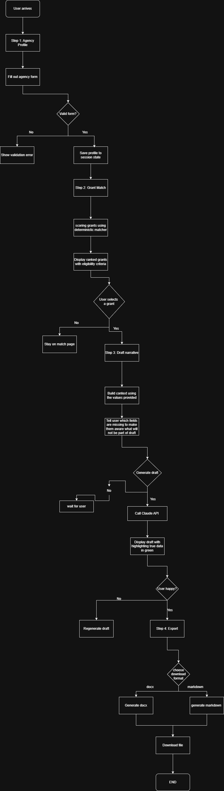
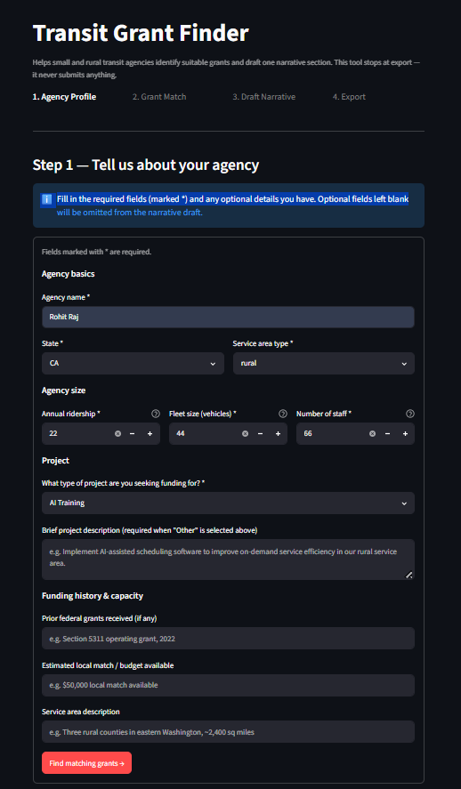
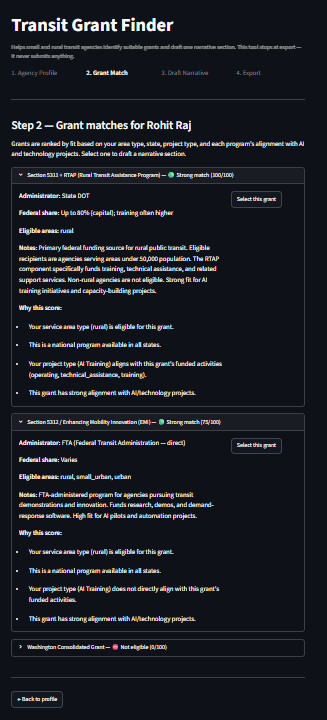
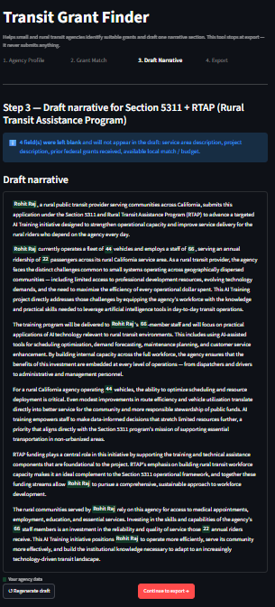
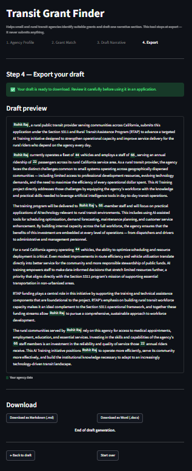

# 🚌 Transit Grant Finder

A local-first web app that helps small and rural transit agencies find suitable grants and draft competitive narratives for AI and technology projects. Built with Streamlit and Claude API.

**Live Demo:** [transit-grant-finder-newusertesting.streamlit.app](https://transit-grant-finder-newusertesting.streamlit.app/)

## 🔄 App Workflow



## 📸 UI Screenshots

| Step 1: Agency Profile | Step 2: Grant Matching |
|------------------------|------------------------|
|  |  |

| Step 3: Narrative Draft | Step 4: Export |
|-------------------------|----------------|
|  |  |

## 🎯 Problem We Solve

Small and rural transit agencies want to adopt AI but lack:

- Budget lines for technology pilots
- Grant writers to fund these initiatives
- Time to research complex federal/state grant programs

This app takes them from idea to  a **drafted, ready-to-review grant application** in minutes, not weeks.

## ✨ Features

- **4-Step Flow** – Agency Profile → Grant Matching → Narrative Drafting → Export
- **Cite-or-Skip Enforcement** – Never invents facts. Uses placeholders for missing data.
- **Deterministic Grant Matching** – Transparent scoring with clear eligibility reasons
- **AI-Assisted Drafting** – Uses Claude API with prompt caching for speed
- **Export Options** – Download as Markdown (.md) or Word (.docx)

## 🚀 Quick Start

### Live Demo

Visit the deployed app: [transit-grant-finder-newusertesting.streamlit.app](https://transit-grant-finder-newusertesting.streamlit.app/)

### Run Locally

**1. Clone the repository**

```bash
git clone https://github.com/yourusername/transit-grant-finder.git
cd transit-grant-finder
```

**2. Install dependencies**

```bash
pip install -r requirements.txt
```

**3. Set up environment variables**

Create a `.env` file in the project root:

```env
ANTHROPIC_API_KEY=your-anthropic-api-key-here
```

**4. Run the app**

```bash
streamlit run app.py
```

**5. Run tests**

```bash
pytest tests/ -v
```

## 📖 How It Works

### Step 1: Agency Profile

Users fill in a form capturing:

- Agency basics (name, state, service area type)
- Size metrics (ridership, fleet size, staff count)
- Project goals (AI training, pilot, or automation)
- Optional details (project description, prior grants, budget)

### Step 2: Grant Matching

The app scores three hardcoded grant programs based on:

- Area type eligibility (rural/small-urban/urban)
- State restrictions (WA Consolidated Grant only)
- Project type alignment
- AI fit (high/medium/low)

Scoring is deterministic and transparent – users see exactly why each grant received its score.

### Step 3: AI-Assisted Drafting

- **Cite-or-skip rule:** Only agency-provided facts are included in the context
- Missing facts are **silently omitted** – no placeholders are sent to Claude
- Claude generates a ~300-500 word narrative section
- Prompt caching reduces latency on repeated drafts

### Step 4: Export

Users can download the draft as:

- Markdown (.md)
- Word (.docx)

Both formats include a disclaimer reminding agencies to review before submission.

## 📁 Project Structure

```text
transit-grant-finder/
├── app.py                 # Main Streamlit application
├── services/
│   ├── matcher.py         # Deterministic grant scoring
│   ├── drafting.py        # Claude API integration with caching
│   ├── export.py          # Markdown/DOCX export
│   └── provenance.py      # Cite-or-skip context filtering
├── data/
│   └── grants.py          # Hardcoded grant data (3 programs)
├── tests/
│   ├── test_matcher.py
│   ├── test_drafting.py
│   ├── test_export.py
│   └── test_provenance.py
├── screenshots/           # UI screenshots and workflow diagram
│   ├── Step_1.png
│   ├── Step_2.png
│   ├── Step_3.png
│   ├── Step_4.png
│   └── take_home_workflow.drawio.png
├── .env.example           # Environment variables template
├── requirements.txt       # Python dependencies
└── README.md              # This file
```
## 📊 Grant Data

The app uses three simplified real grant programs:

| Program | Admin | Eligible Areas | AI Fit |
|---------|-------|----------------|--------|
| Section 5311 + RTAP | State DOT | Rural only | High (training) |
| WA Consolidated Grant | WSDOT | Rural/Small-urban (WA only) | Medium-High |
| Section 5312 / EMI | FTA | All areas | High (pilots/automation) |

## 📄 License

MIT License – see [LICENSE](LICENSE) file for details.
